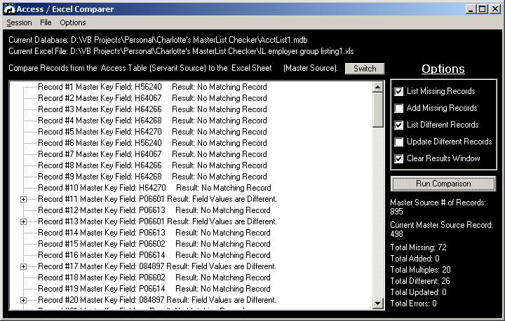



## Access / Excel Comparer

### Description

Generic Utility to compare an Access Table with an Excel SpreadSheet. Neither Microsoft Access, nor Microsoft Excel needs to be installed to use this, since it uses ADO to compare the files. Multi session settings can be saved. This is a complete VB project. A precompiled Installation/Setup is available on my site, http://wolfwares.com
 
### More Info
 
The settings database needs to be in the same directory as the source/.exe.

Allowing this utility to update existing records or add missing records is an option. I recommend that you backup your files before you use these options.

             |
---                |---
**Submitted On**   |2002-10-16 19:17:36
**By**             |[Drew Wutka](https://github.com/Planet-Source-Code/PSCIndex/blob/master/ByAuthor/drew-wutka.md)
**Level**          |Intermediate
**User Rating**    |4.8 (19 globes from 4 users)
**Compatibility**  |VB 6\.0
**Category**       |[Complete Applications](https://github.com/Planet-Source-Code/PSCIndex/blob/master/ByCategory/complete-applications__1-27.md)
**World**          |[Visual Basic](https://github.com/Planet-Source-Code/PSCIndex/blob/master/ByWorld/visual-basic.md)
**Archive File**   |[Access\_\_\_E14715910162002\.zip](https://github.com/Planet-Source-Code/drew-wutka-access-excel-comparer__1-39892/archive/master.zip)

